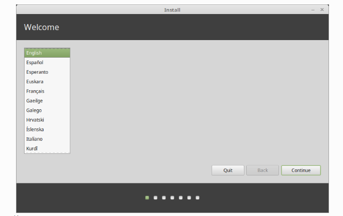
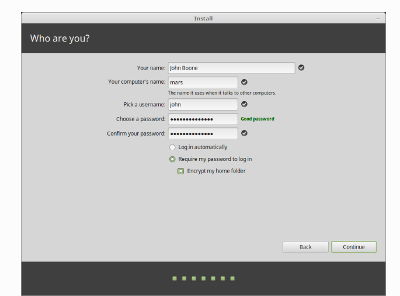

# 简介

ROBOTIS-OP2 默认随 Lubuntu 12.04 一起安装，
虽然在 Lubuntu 12.04（Precise Pangolin）上也可以安装 Hydro Medusa ROS，但建议尽量使用最新版本。

~~由于 Ubuntu 16.04 和 18.04 的 SBC 图形驱动程序存在问题（无法正常使用外接显示器或者VNC进行远程桌面可视化），因此建议安装基于 Ubuntu 14.04 (Trusty Tahr) 的**Linux Mint 17.3 (Rosa) - Xfce (32bit)，**以便使用 ROS 操作 ROBOTIS-OP2。~~

**注意**：安装后**请勿**升级内核。升级内核可能会导致图形驱动程序问题。即**不允许随意**对系统或其他功能包进行升级。

# 操作系统安装

Linux Mint comes in 3 different flavours, each featuring a different desktop environment.

| Linux Mint Flavors | Description                                           |
| ------------------ | ----------------------------------------------------- |
| Cinnamon           | The most modern, innovative and full-featured desktop |
| MATE               | A more traditional, and faster desktop                |
| Xfce               | The most lightweight desktop                          |

选择 [Linux Mint 17.3 “Rosa” - Xfce（32 位）](https://www.linuxmint.com/edition.php?id=213)

下载：https://blog.linuxmint.com/?p=2977

支持：Ubuntu 14.04 **停止服务于2019**


现在建议（时间2024/6/6）

使用支持到2025年的Ulyana

下载：https://www.linuxmint.com/edition.php?id=283

下载2：链接：https://pan.baidu.com/s/1r-DrqYxdMjLqTwIB5TxulQ?pwd=kt6a  提取码：kt6a 

支持：Ubuntu 20.04 LTS **停止服务于2025**

## 创建USB系统盘

### window

下载[Etcher](https://www.balena.io/etcher/)，安装并运行它。

[](https://linuxmint-installation-guide.readthedocs.io/en/latest/_images/etcher.png)

单击**“选择图像”**并选择 ISO 文件。

单击**“选择驱动器”**并选择USB 驱动器。

点击**Flash！**

## 启动Linux Mint

1. 将 USB 闪存盘插入计算机。
2. 重新启动计算机。
3. 在计算机启动当前操作系统（Windows、Mac、Linux）之前，应该会看到[BIOS](https://en.wikipedia.org/wiki/BIOS)加载屏幕。检查屏幕或计算机文档以了解要按哪个键并指示计算机通过 USB启动。（DARWIN-OP 按 F2 键）
4. Linux Mint ISO 可以在 EFI 或 BIOS 模式下启动。在 EFI 模式下，它会显示 grub 菜单。在 BIOS 模式下，它会显示 isolinux 菜单。
5. 从其中一个菜单中，按下Enter即可从 USB 启动盘启动 Linux Mint。


## Linux Mint安装

### 系统盘启动

当你从USB启动盘启动计算机时，Linux Mint 会启动。它会自动以用户身份登录，并向你显示带有安装程序的桌面：`live session` `mint`


**注意：**实时会话的用户名是`mint`。如果要求输入密码，请按Enter。

### 正式安装

要在你的计算机上永久安装 Linux Mint：

1.双击**安装 Linux Mint**。

2.选择你的语言。



3.连接到互联网。


4.如果你已连接到互联网，请勾选此框以安装多媒体编解码器。


5.选择安装类型。


**注意：**如果 Linux Mint 是您想要在这台计算机上运行的唯一操作系统，并且硬盘上的所有数据都可能丢失，请选择**擦除磁盘并安装 Linux Mint**。

6.选择你的时区。


**注意：**选择shanghai

7.选择键盘布局。


**注意：**选择中文

8.输入您的用户详细信息。



9.在您的计算机上安装 Linux Mint 后，欣赏幻灯片。


安装完成后，单击“**立即重启”**。


然后计算机将开始关闭并要求你移除 USB 磁盘（或 DVD）。重新启动后，你的计算机应显示启动菜单或启动新安装的 Linux Mint 操作系统。


# ROS安装

### 基础安装方式

[ROS Indigo 的安装](http://wiki.ros.org/indigo/Installation/Ubuntu)

由于Linux Mint 17.3 “Rosa”已经停止服务，上述对应的Ubuntu 14.04 版本ROS安装已经不支持。仅供参考。

Ubuntu 20.04 LTS 对应 ROS Noetic 支持至 2025 年 5 月

[ROS Noetic 的安装](https://wiki.ros.org/noetic/Installation/Ubuntu)

### 更好的安装方式

**一键安装指令**

```shell
wget http://fishros.com/install -O fishros && . fishros
```

跟随命令行提示执行即可[更多内容](https://fishros.org.cn/forum/topic/20/%E5%B0%8F%E9%B1%BC%E7%9A%84%E4%B8%80%E9%94%AE%E5%AE%89%E8%A3%85%E7%B3%BB%E5%88%97)


# ROBOTIS-OP2 的 ROS 包

一旦正确安装了 ROS，就应该安装依赖包来操作 ROBOTIS-OP2。一些用于 ROBOTIS-OP3 的 ROS 包可以直接使用，而其他包则需要进行一些修改。
针对 ROBOTIS-OP2 修改的包已上传到单独的存储库。
按照以下说明下载包：

```
cd ~/catkin_ws/src
git clone https://github.com/ROBOTIS-GIT/DynamixelSDK
git clone https://github.com/ROBOTIS-GIT/ROBOTIS-Framework
git clone https://github.com/ROBOTIS-GIT/ROBOTIS-Framework-msgs
git clone https://github.com/ROBOTIS-GIT/ROBOTIS-Math
git clone https://github.com/ROBOTIS-GIT/ROBOTIS-OP2
git clone https://github.com/ROBOTIS-GIT/ROBOTIS-OP2-Common
git clone https://github.com/ROBOTIS-GIT/ROBOTIS-OP3
git clone https://github.com/ROBOTIS-GIT/ROBOTIS-OP3-msgs
git clone https://github.com/ROBOTIS-GIT/ROBOTIS-OP3-Tools
```

### **ROBOTIS-OP2 存储库**

存储库位置：https://github.com/ROBOTIS-GIT/ROBOTIS-OP2

cm_740_module：从 ROBOTIS-OP3 存储库移出。
op2_gui_demo：一些配置文件和启动文件已被修改以在 ROBOTIS-OP2 上运行 op3_gui_demo。
op2_kinematics_dynamics：仅根据ROBOTIS-OP2修改了op2_walking_module中使用的关节方向等一些值。
op2_manager：对 ROBOTIS-OP2 的运动模块和配置文件进行了一些修改。与 ROBOTIS-OP3 中的 OpenCR 不同，ROBOTIS-OP2 中的 CM-740 将 DYNAMIXEL Power OFF 作为默认设置。因此，修改了源代码以处理这种差异。
op2_walking_module：针对ROBOTIS-OP2的修改代码（关节方向、平衡增益等）

### ROBOTIS-OP2-通用存储库

存储库位置：https://github.com/ROBOTIS-GIT/ROBOTIS-OP2-Common

robotis_op2_description：ROBOTIS-OP2 URDF 模型

robotis_op2_gazebo：ROBOTIS-OP2 凉亭模拟

### 如何运行 GUI 程序

构建源代码

```
cd ~/catkin_ws
catkin_make
```

执行 op2_manager

```
roslaunch op2_manager op2_manager.launch
```

当 op2_manager 启动时，所有关节都会扭矩开启，并首先播放站立动作，然后再播放坐姿动作。

将 VNC 查看器或显示器连接到 ROBOTIS-OP2 并执行 GUI 演示程序。

```
roslaunch op2_gui_demo op2_demo.launch
```

# 来源

> https://linuxmint-installation-guide.readthedocs.io/en/latest/
>
> https://www.fishros.com/
>
> https://emanual.robotis.com/docs/en/platform/op2/getting_started/


